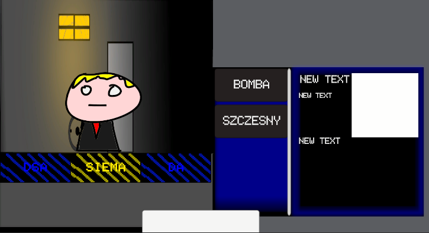

# 1. Core Gameplay Loop

The main gameplay loop is divided into cases. Each case challenges the player with a unique mystery and a distinct set of characters.

To discover the truth, the player must interrogate suspects and analyze evidence—this is their primary weapon of deduction.

In a standard scenario, the player must identify victims, culprits, and pinpoint an **UnPerson** among them. The player must make these deductions entirely on their own; the game will not hold their hand or indicate whether they are heading in the right direction.

## 2. Investigation Mechanics

At the start of each case, the player is provided with a set of dialogues, evidence, and profiles for each suspect, supplied by the government surveillance system. However, the player can unlock new options by making the correct calls during their investigation.

* **Evidence-Linked Dialogues:** Some dialogue options can only be accessed if the player connects them to suitable evidence. These dialogues are highlighted in yellow. Selecting these might unlock new conversation paths with other suspects or yield new evidence and items.
* **Mutually Exclusive Choices:** Other interactions will force the player to choose between dialogue options that exclude one another. Each choice leads to a different result, and even a theoretically "bad" outcome can trigger interesting consequences later in the game.

Decisions and consequences in dialogue are the main objectives of this design, and I plan to implement many more of these events throughout the game.

## 3. Detecting UnPersons

The player is equipped with a manual outlining the basic behaviors and signs of an UnPerson (e.g., forgetting a relative's name, expressing conflicting ideas, or possessing out-of-place knowledge). However, these are only the baseline symptoms.

UnPersons who are self-aware or acting with a specific goal in mind will be much harder to detect. The player will need to identify complex behavioral patterns or subtle signals to expose them effectively.

## 4. Consequences & Progression

The player's performance and decisions directly impact future game events, the overall length of the game, and the final ending. Above all, the player must constantly balance their investigation with the demands of their **Supervisor**.

## 5. UI and Design Philosophy

The dominant color palette of the game is blue. The goal is to make the player physically feel the tiresome, bureaucratic nature of the protagonist's work, surrounded by monitors and harsh lighting.

This creates an oppressive, office-like atmosphere. When combined with the heavy tone of the narrative, it frames the drastic—and often cruel—decisions the player makes as "just another day at the office."

### UI Mechanics & Visual Feedback

The UI strategically utilizes colors and movement to convey information without relying on text:

* **Yellow Evidence Options:** When the player selects a yellow (evidence-linked) dialogue option, the animation of that specific dialogue panel will stop, while the others continue moving. This provides immediate, non-verbal feedback about their selection.
* **Error Indication:** With each incorrect answer or deduction, the UI button will progressively turn gray from left to right, until it is completely grayed out. This visual progression is demonstrated below:

**Correct State (No wrong connections):**

**1 Wrong Connection:**

**2 Wrong Connections:**

**3 Wrong Connections (Maximum errors):**

My overarching goal is to express game mechanics entirely through color and movement, maximizing player immersion.

There is still much planned for development: inventory items, a crucial relationship system with the Supervisor, a comprehensive notes system, and much more. The possibilities for expansion are infinite.